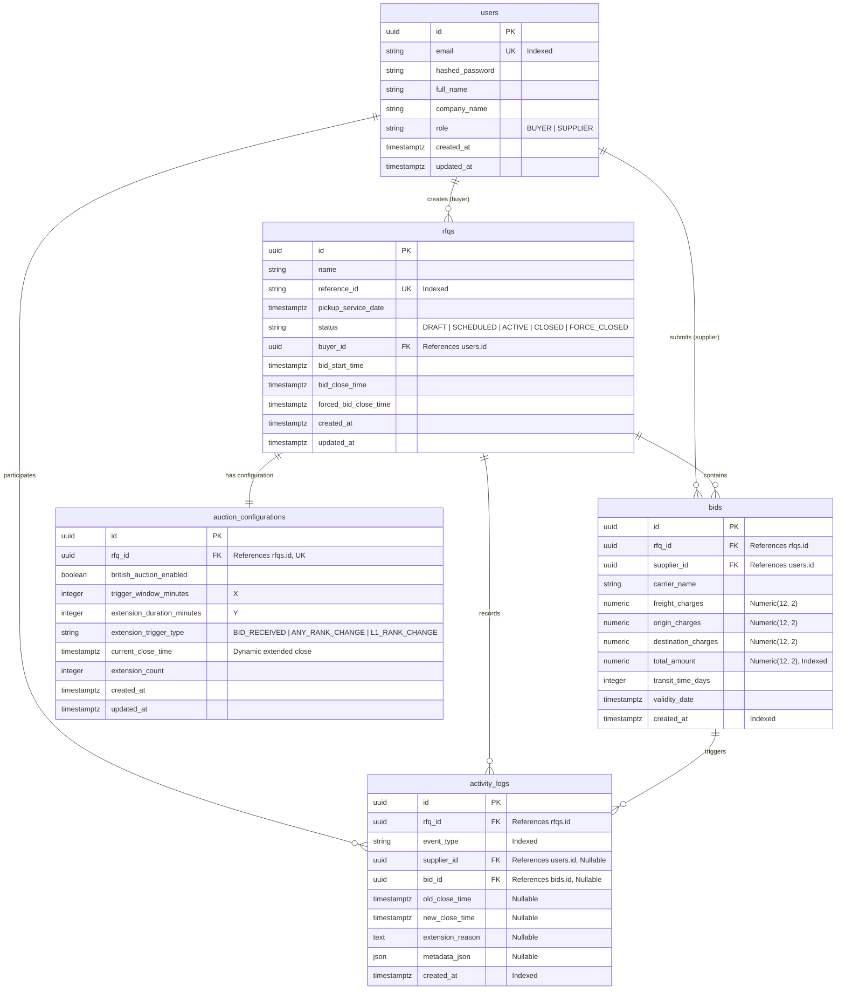

# Database Documentation — British Auction in RFQ System

## 1. Entity-Relationship Diagram (ERD)

---

## 2. Table Specifications

### 2.1 Table: `users`
Stores user identities and organizational credentials for both Buyers and Suppliers.

| Column | Data Type | Nullable | Default | Description |
| :--- | :--- | :---: | :--- | :--- |
| `id` | `UUID` | No | `uuid_generate_v4()` | Primary Key |
| `email` | `VARCHAR(255)` | No | - | Unique login email address (Indexed) |
| `hashed_password` | `VARCHAR(255)` | No | - | Bcrypt hashed password |
| `full_name` | `VARCHAR(255)` | No | - | User's full contact name |
| `company_name` | `VARCHAR(255)` | No | - | Company or enterprise entity name |
| `role` | `VARCHAR(50)` | No | `'SUPPLIER'` | Role: `BUYER` or `SUPPLIER` |
| `created_at` | `TIMESTAMPTZ` | No | `CURRENT_TIMESTAMP` | Account creation timestamp |
| `updated_at` | `TIMESTAMPTZ` | No | `CURRENT_TIMESTAMP` | Account update timestamp |

**Indexes & Constraints**:
- `PRIMARY KEY (id)`
- `UNIQUE INDEX ix_users_email (email)`

---

### 2.2 Table: `rfqs`
Stores Request for Quotation definitions, shipping dates, and bidding lifecycle limits.

| Column | Data Type | Nullable | Default | Description |
| :--- | :--- | :---: | :--- | :--- |
| `id` | `UUID` | No | `uuid_generate_v4()` | Primary Key |
| `name` | `VARCHAR(255)` | No | - | RFQ procurement project name |
| `reference_id` | `VARCHAR(100)` | No | - | Unique business reference code (Indexed) |
| `pickup_service_date` | `TIMESTAMPTZ` | No | - | Scheduled freight pickup or service date |
| `status` | `VARCHAR(50)` | No | `'DRAFT'` | State: `DRAFT`, `SCHEDULED`, `ACTIVE`, `CLOSED`, `FORCE_CLOSED` |
| `buyer_id` | `UUID` | No | - | FK references `users.id` (ON DELETE CASCADE) |
| `bid_start_time` | `TIMESTAMPTZ` | No | - | Opening datetime for supplier bids |
| `bid_close_time` | `TIMESTAMPTZ` | No | - | Initial closing datetime before extensions |
| `forced_bid_close_time` | `TIMESTAMPTZ` | No | - | Mandatory hard stop datetime |
| `created_at` | `TIMESTAMPTZ` | No | `CURRENT_TIMESTAMP` | Record creation timestamp |
| `updated_at` | `TIMESTAMPTZ` | No | `CURRENT_TIMESTAMP` | Record update timestamp |

**Indexes & Constraints**:
- `PRIMARY KEY (id)`
- `UNIQUE INDEX ix_rfqs_reference_id (reference_id)`
- `INDEX ix_rfqs_status (status)`
- `INDEX ix_rfqs_buyer_id (buyer_id)`
- `CHECK (forced_bid_close_time > bid_close_time)`
- `CHECK (bid_close_time > bid_start_time)`

---

### 2.3 Table: `auction_configurations`
Stores the British Auction parameters and dynamic extension state.

| Column | Data Type | Nullable | Default | Description |
| :--- | :--- | :---: | :--- | :--- |
| `id` | `UUID` | No | `uuid_generate_v4()` | Primary Key |
| `rfq_id` | `UUID` | No | - | FK references `rfqs.id` (ON DELETE CASCADE, Unique) |
| `british_auction_enabled` | `BOOLEAN` | No | `TRUE` | Whether British Auction extension rules apply |
| `trigger_window_minutes` | `INTEGER` | No | `10` | Parameter X (monitoring window before close) |
| `extension_duration_minutes` | `INTEGER` | No | `5` | Parameter Y (minutes added per qualifying trigger) |
| `extension_trigger_type` | `VARCHAR(50)` | No | `'BID_RECEIVED'` | Trigger type: `BID_RECEIVED`, `ANY_RANK_CHANGE`, `L1_RANK_CHANGE` |
| `current_close_time` | `TIMESTAMPTZ` | No | - | Active bid close time (extended dynamically) |
| `extension_count` | `INTEGER` | No | `0` | Number of extensions granted |
| `created_at` | `TIMESTAMPTZ` | No | `CURRENT_TIMESTAMP` | Record creation timestamp |
| `updated_at` | `TIMESTAMPTZ` | No | `CURRENT_TIMESTAMP` | Record update timestamp |

**Indexes & Constraints**:
- `PRIMARY KEY (id)`
- `UNIQUE INDEX ix_auction_configurations_rfq_id (rfq_id)`
- `CHECK (trigger_window_minutes >= 0)`
- `CHECK (extension_duration_minutes > 0)`

---

### 2.4 Table: `bids`
Stores all competitive quotes submitted by suppliers.

| Column | Data Type | Nullable | Default | Description |
| :--- | :--- | :---: | :--- | :--- |
| `id` | `UUID` | No | `uuid_generate_v4()` | Primary Key |
| `rfq_id` | `UUID` | No | - | FK references `rfqs.id` (ON DELETE CASCADE) |
| `supplier_id` | `UUID` | No | - | FK references `users.id` (ON DELETE CASCADE) |
| `carrier_name` | `VARCHAR(255)` | No | - | Designated carrier or fleet operator |
| `freight_charges` | `NUMERIC(12, 2)` | No | - | Line-haul freight charges |
| `origin_charges` | `NUMERIC(12, 2)` | No | - | Origin terminal and handling fees |
| `destination_charges` | `NUMERIC(12, 2)` | No | - | Destination delivery and terminal fees |
| `total_amount` | `NUMERIC(12, 2)` | No | - | Total price = freight + origin + destination |
| `transit_time_days` | `INTEGER` | No | - | Estimated transit duration in days |
| `validity_date` | `TIMESTAMPTZ` | No | - | Date until which the quote is legally valid |
| `created_at` | `TIMESTAMPTZ` | No | `CURRENT_TIMESTAMP` | Authoritative bid timestamp (Indexed) |

**Indexes & Constraints**:
- `PRIMARY KEY (id)`
- `INDEX ix_bids_rfq_id (rfq_id)`
- `INDEX ix_bids_supplier_id (supplier_id)`
- `INDEX ix_bids_total_amount (total_amount)`
- `INDEX ix_bids_created_at (created_at)`
- `CHECK (total_amount > 0)`
- `CHECK (freight_charges >= 0 AND origin_charges >= 0 AND destination_charges >= 0)`

---

### 2.5 Table: `activity_logs`
Audit trail of auction events, bid placements, time extensions, and reasons.

| Column | Data Type | Nullable | Default | Description |
| :--- | :--- | :---: | :--- | :--- |
| `id` | `UUID` | No | `uuid_generate_v4()` | Primary Key |
| `rfq_id` | `UUID` | No | - | FK references `rfqs.id` (ON DELETE CASCADE) |
| `event_type` | `VARCHAR(50)` | No | - | Event: `RFQ_CREATED`, `BID_SUBMITTED`, `AUCTION_EXTENDED`, `AUCTION_CLOSED`, `AUCTION_FORCE_CLOSED` |
| `supplier_id` | `UUID` | Yes | `NULL` | FK references `users.id` (ON DELETE SET NULL) |
| `bid_id` | `UUID` | Yes | `NULL` | FK references `bids.id` (ON DELETE SET NULL) |
| `old_close_time` | `TIMESTAMPTZ` | Yes | `NULL` | Close time before extension |
| `new_close_time` | `TIMESTAMPTZ` | Yes | `NULL` | Close time after extension |
| `extension_reason` | `TEXT` | Yes | `NULL` | Human-readable explanation of the extension |
| `metadata_json` | `JSON` | Yes | `NULL` | Structured event metadata |
| `created_at` | `TIMESTAMPTZ` | No | `CURRENT_TIMESTAMP` | Event timestamp (Indexed) |

**Indexes & Constraints**:
- `PRIMARY KEY (id)`
- `INDEX ix_activity_logs_rfq_id (rfq_id)`
- `INDEX ix_activity_logs_event_type (event_type)`
- `INDEX ix_activity_logs_created_at (created_at)`
