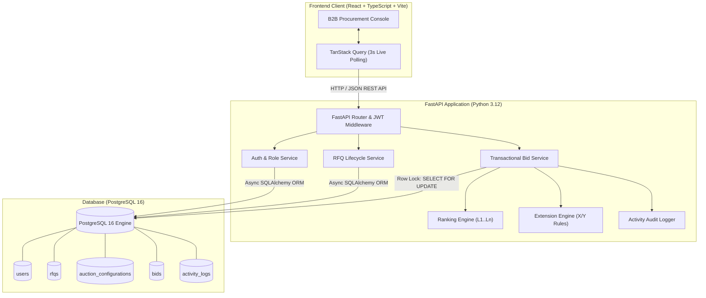
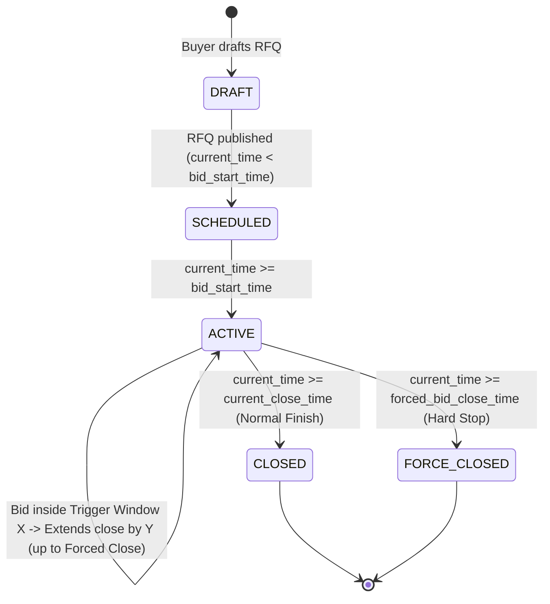
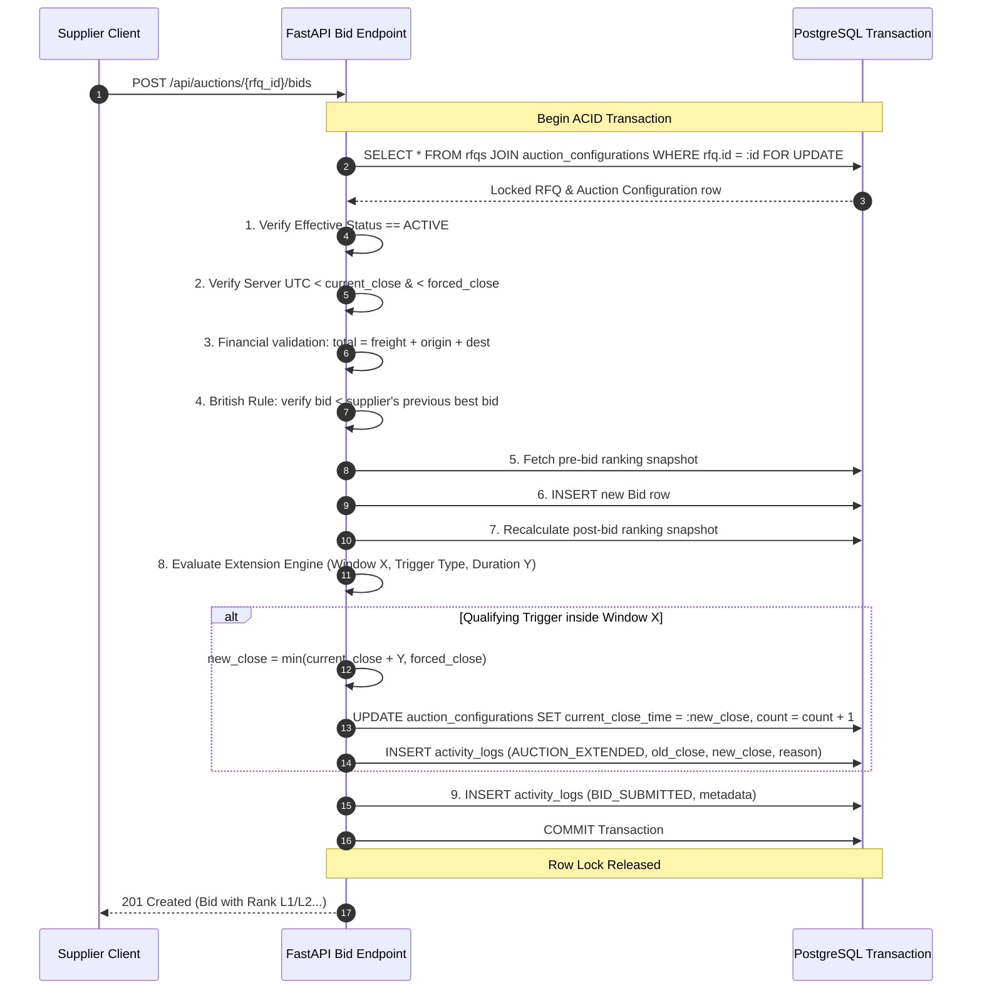

# High-Level Design (HLD) — British Auction in RFQ System

## 1. Executive Summary & Problem Statement

An **RFQ (Request for Quotation)** system enables buyers to source services and products competitively from multiple suppliers. Traditional reverse auctions often suffer from **sniping** (last-second bid placement preventing competitors from reacting) or arbitrary closing decisions.

A **British Auction** solves this problem by introducing **dynamic, activity-based time extensions**:
1. Suppliers compete openly by continuously submitting lower prices.
2. If competitive bidding activity occurs within a configurable trigger window (**X minutes**) before the auction close, the auction automatically extends by **Y minutes**.
3. The auction is governed by an immutable **Forced Bid Close Time** (hard stop), ensuring an auction never extends indefinitely.

This document describes the high-level architecture, transactional concurrency model, extension engine semantics, ranking algorithms, and engineering assumptions implemented in this platform.

---

## 2. System Architecture

The platform follows a decoupled, cloud-ready 3-tier architecture:

### Component Responsibilities

| Layer | Technology | Primary Responsibilities |
| :--- | :--- | :--- |
| **Frontend** | React 18, TypeScript, Tailwind CSS, TanStack Query, Recharts | B2B Procurement UX, live countdown timers, British Auction configuration display, quote submission forms with client validation, dynamic rankings table (distinguishing L1), activity audit timeline, and price evolution charts. |
| **Backend** | FastAPI, Pydantic v2, SQLAlchemy 2.0, Uvicorn | REST API gateway, JWT authentication, role-based authorization (BUYER vs SUPPLIER), pessimistic transactional row-locking, dynamic auction state resolution, mathematical extension calculation, ranking recalculation, and audit logging. |
| **Database** | PostgreSQL 16 | ACID-compliant relational storage, row-level locks (`SELECT ... FOR UPDATE`), check constraints, foreign keys with cascade semantics, and b-tree indexes on reference IDs, timestamps, and foreign keys. |

---

## 3. Auction Lifecycle State Machine

The auction lifecycle is strictly evaluated on the server using authoritative UTC timestamps and database state:

### Auction States

1. **`DRAFT`**: RFQ created in draft status. No supplier visibility or bidding allowed.
2. **`SCHEDULED`**: RFQ published. Current server UTC time is before `bid_start_time`. Suppliers can view details and countdown to start, but bids are rejected.
3. **`ACTIVE`**: Current server UTC time is between `bid_start_time` and `current_close_time`. Suppliers can submit bids. Extension triggers are evaluated in real time.
4. **`CLOSED`**: Current time has passed `current_close_time`. All bidding is rejected. Final rankings stand.
5. **`FORCE_CLOSED`**: Current time has reached or passed `forced_bid_close_time`. The auction hard stop has been enforced. Extensions and bids are permanently halted.

---

## 4. Transactional Bidding & Concurrency Model

Bidding in a reverse auction is inherently concurrent. Multiple suppliers may submit bids simultaneously in the final seconds of an auction. To prevent race conditions, stale rankings, and double-extension glitches, bid placement executes within an atomic PostgreSQL transaction with pessimistic row-locking.

### Bid Transaction Sequence

---

## 5. Extension Engine & Mathematical Semantics

The extension engine implements the three triggers specified in the assignment:

### Parameters
- **`X` (Trigger Window in Minutes)**: The monitoring window before the auction end.
- **`Y` (Extension Duration in Minutes)**: The duration added to the current close time when triggered.
- **`current_close_time`**: The dynamically shifting close time of the auction.
- **`forced_bid_close_time`**: The absolute maximum close time (hard limit).

### Trigger Window Evaluation
Given a bid submitted at server UTC timestamp $T$:
$$\text{Window Start} = \text{current\_close\_time} - X \text{ minutes}$$
$$\text{Is In Trigger Window} \iff \text{Window Start} \le T \le \text{current\_close\_time}$$

If $T < \text{Window Start}$, the bid is valid but **does not trigger an extension**.

### Extension Trigger Types

1. **`BID_RECEIVED` ("Bid Received in Last X Minutes")**:
   - Any valid bid submitted in the trigger window causes an extension.
   - Reason Log: `"Bid of $P received from Supplier during the last X-minute trigger window."`

2. **`ANY_RANK_CHANGE` ("Any Supplier Rank Change in Last X Minutes")**:
   - Triggers if the relative ranking position of *any* supplier changes due to the new bid, or if a new supplier enters the ranking.
   - Reason Log: `"Supplier ranking changed in the last X-minute trigger window due to bid from Supplier."`

3. **`L1_RANK_CHANGE` ("Lowest Bidder (L1) Rank Change in Last X Minutes")**:
   - Triggers **only** when the supplier holding the lowest price (L1 position) changes.
   - If the current L1 supplier submits an even lower bid to widen their lead, the L1 *supplier* did not change; therefore, **no extension occurs**.
   - If another supplier beats the current L1 price, the L1 supplier changes; therefore, **extension occurs**.
   - Reason Log: `"Lowest bidder (L1) changed from Supplier A to Supplier B during the last X-minute trigger window."`

### Forced Close Hard Limit Enforcement
$$\text{candidate\_close} = \text{current\_close\_time} + Y \text{ minutes}$$
$$\text{new\_close\_time} = \min(\text{candidate\_close}, \text{forced\_bid\_close\_time})$$

- If $\text{current\_close\_time} == \text{forced\_bid\_close\_time}$, no extension is possible.
- If $\text{candidate\_close} > \text{forced\_bid\_close\_time}$, the extension is clamped exactly to $\text{forced\_bid\_close\_time}$, and the activity log notes:
  `"(Extension capped at Forced Bid Close Time, added K min instead of Y min)"`.

---

## 6. Ranking Engine & Tie-Breaking

- **Ranking Basis**: Total bid price in ascending order ($\text{total\_amount} = \text{freight\_charges} + \text{origin\_charges} + \text{destination\_charges}$).
- **Participant Consolidation**: Each supplier's competitive rank is determined by their single **lowest (best)** valid bid submitted for that RFQ.
- **Tie-Breaking Rule**: If two distinct suppliers submit the exact same total price, the tie is broken deterministically by **earliest submission timestamp** (`created_at ASC`). The earlier bid receives the higher rank (e.g., L1 over L2).

---

## 7. Engineering Decisions / Assumptions

*(Documented as required by Section 1 and Section 27 of the project specification)*

1. **Monetary Precision**: All monetary values are handled using `NUMERIC(12, 2)` in PostgreSQL and Python `Decimal` to avoid IEEE 754 binary floating-point rounding inaccuracies.
2. **British Auction Price Decrement Rule**: A supplier's first bid may be any positive amount ($> \$0.00$). Any subsequent bid by the *same supplier* must be strictly lower than that supplier's previous lowest valid bid for that RFQ.
3. **Quote Charges Summation**: The quote form captures freight charges, origin charges, and destination charges. The authoritative `total_amount` is calculated and verified server-side as $\text{freight} + \text{origin} + \text{destination}$.
4. **Subsequent Extensions**: After an auction is extended from $T_1$ to $T_2$, the new monitoring trigger window becomes $[T_2 - X, T_2]$. Subsequent bids falling in this new window will trigger further extensions, provided $T_2 < \text{forced\_bid\_close\_time}$.
5. **Real-time Client Updates**: Implemented via TanStack Query polling at 3-second intervals on active auction consoles. This provides sub-second perceptual latency without the connection drop and reconnect complexity of WebSockets in restricted proxy environments.
6. **Timezone Authority**: All timestamps are stored and evaluated in UTC. Frontends render timestamps according to the user's localized browser format.

---

## 8. Security Considerations

- **Password Storage**: Passwords hashed using `bcrypt` with salt rounds.
- **JWT Authorization**: Stateless bearer tokens signed with HMAC-SHA256 (`HS256`).
- **Role Separation**:
  - `BUYER`: Can create RFQs, view all auction consoles, inspect logs. Cannot place bids.
  - `SUPPLIER`: Can view active/closed RFQs, inspect rankings, view own bids, place competitive quotes. Cannot create RFQs or modify auction settings.
- **Input Validation**: Backend validation with Pydantic v2 ensures malformed payloads, invalid dates, and negative numbers are rejected at the edge.
